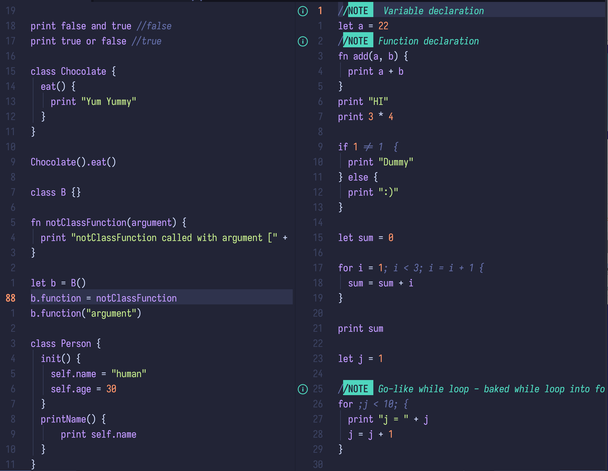

## Tiny Dynamic Programming Language 

dynamically-typed programming language 

> [!WARNING]
> Personal Project - to explore how interpreters work

### Features

* Dynamic Typing: Variables do not require explicit type declaration.
* Interactive Shell: Execute code line-by-line for testing and exploration.
* Execute a source file.

### Getting Started

1. **Prerequisites:** 

    * Kotlin ([https://kotlinlang.org/](https://kotlinlang.org/))

### Usage

* Use the Repl
* Run an entire source file

### **Example:**
see demo file [here](demo)
code snippet 

## TODO list

* [x] Control flow
* [x] Functions with parameters
* [x] Closures
* [x] Classes
* [x] Methods
* [x] Inheritance

